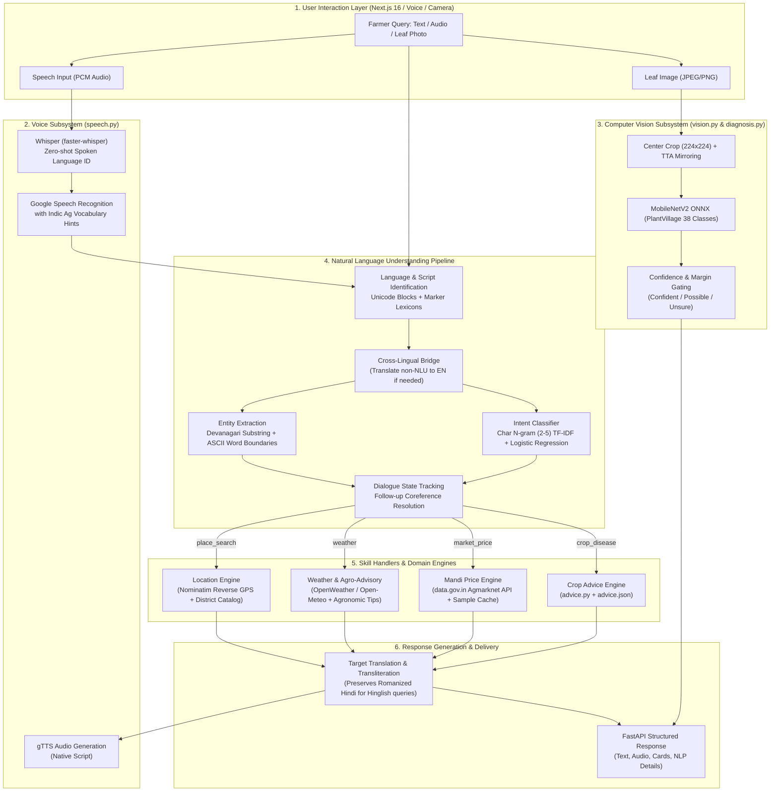

# 🌾 KisanMitra AI (किसानमित्र)
### An Intelligent Multilingual NLP & Multimodal Agricultural Assistant for Indian Farmers

[](https://www.python.org/)
[](https://fastapi.tiangolo.com/)
[](https://nextjs.org/)
[](https://opensource.org/licenses/MIT)
[]()

> **KisanMitra AI** is an end-to-end, privacy-respecting, multimodal agricultural conversational agent built specifically for Indian farmers. It enables farmers to communicate in **Devanagari Hindi, Marathi, English, or Romanized Hindi (Hinglish)** via **text, hands-free voice, or crop leaf photos** to obtain real-time mandi prices, hyper-local weather alerts with agronomic tips, and crop disease diagnosis.

---

## 📑 Table of Contents
1. [Project Overview & Problem Statement](#-project-overview--problem-statement)
2. [High-Level Architecture](#-high-level-architecture)
3. [Deep-Dive Technical Pipeline](#-deep-dive-technical-pipeline)
   - [Step 1: Language & Script Identification (`langid.py`)](#step-1-language--script-identification-langidpy)
   - [Step 2: Sublinear Character N-Gram Intent Classifier (`intent.py`)](#step-2-sublinear-character-n-gram-intent-classifier-intentpy)
   - [Step 3: Morphologically-Aware Entity Extraction (`entities.py`)](#step-3-morphologically-aware-entity-extraction-entitiespy)
   - [Step 4: Dialogue State & Context Tracking (`pipeline.py`)](#step-4-dialogue-state--context-tracking-pipelinepy)
   - [Step 5: Skill Execution & Domain Engines](#step-5-skill-execution--domain-engines)
   - [Step 6: Bidirectional Translation & Romanization (`translate.py`)](#step-6-bidirectional-translation--romanization-translatepy)
   - [Step 7: Multimodal Computer Vision Subsystem (`vision.py` & `diagnosis.py`)](#step-7-multimodal-computer-vision-subsystem-visionpy--diagnosispy)
   - [Step 8: Voice Engine (Whisper + Google STT + gTTS) (`speech.py`)](#step-8-voice-engine-whisper--google-stt--gtts-speechpy)
4. [Backend Infrastructure & API Design (`server.py`)](#-backend-infrastructure--api-design-serverpy)
5. [Modern Next.js 16 Web Interface (`web/`)](#-modern-nextjs-16-web-interface-web)
6. [Datasets & Knowledge Bases](#-datasets--knowledge-bases)
7. [Installation & Quick Start](#-installation--quick-start)
8. [Testing & Quality Assurance](#-testing--quality-assurance)
9. [Viva & Academic Defense Guide (Q&A for Examiners)](#-viva--academic-defense-guide-qa-for-examiners)

---

## 🎯 Project Overview & Problem Statement

Indian agriculture employs over 50% of the country's workforce, yet farmers face steep technological barriers:
1. **Linguistic Diversity & Dialects:** India has 22 scheduled languages with hundreds of regional dialects. Standard NLP tools trained on formal English fail completely in rural India.
2. **The "Hinglish" / Romanized Script Challenge:** Most farmers using smartphones type Hindi or Marathi in Latin script (*"tamatar ke patte peele ho gaye hain, kya dawai daalu?"*). Off-the-shelf language identifiers (e.g., `langdetect`, `fastText`) misidentify these inputs as English, Indonesian, or Italian.
3. **Agglutinative Morphology:** Devanagari languages heavily decline nouns with case markers (*"नाशिकमध्ये"* → Nashik in, *"कांद्याचा"* → onion's). Simple token-matching models miss inflected entities.
4. **Zero-Budget Constraint:** Enterprise LLM APIs (OpenAI, Anthropic) incur high token costs and latency unsuitable for free rural advisory. KisanMitra is engineered to run on **100% free APIs and local on-device machine learning models**.

---

## 🏗 High-Level Architecture



---

## 🔬 Deep-Dive Technical Pipeline

### Step 1: Language & Script Identification ([`kisanmitra/langid.py`](file:///Users/akashvishwakarma/nlp-project/kisanmitra/langid.py))
Language detection is split into **script detection** and **lexical marker routing**:
1. **Unicode Codepoint Character Inspection:** The text is scanned against Indic Unicode blocks (`Devanagari 0x0900–0x097F`, `Bengali 0x0980–0x09FF`, `Telugu 0x0C00–0x0C7F`, etc.).
2. **Hindi vs. Marathi Devanagari Disambiguation:** Both use Devanagari script. Disambiguation uses frequency scoring of grammatical marker tokens:
   - *Marathi Markers:* `आहे`, `आहेत`, `काय`, `माझ्या`, `नाही`, `कसे`, `मध्ये`, `उद्या`, `पाऊस`, plus inflected suffixes (`च्या`, `चा`, `ची`).
   - *Hindi Markers:* `है`, `हैं`, `का`, `की`, `के`, `में`, `क्या`, `रहा`, `बताओ`, `होगी`.
3. **Romanized Hindi (Hinglish) vs. English:** Latin inputs are evaluated against a curated lexicon of 60+ Hinglish marker tokens (`hai`, `kya`, `bhav`, `fasal`, `patte`, `dawai`, `baarish`). If Hinglish markers outweigh English stopwords, the language is flagged as `hi` with script `latin`.
4. **Multimodal Audio Disambiguation:** When input arrives via voice, Whisper's acoustic language detection probability is passed directly to the pipeline, resolving Devanagari ambiguities before text processing.

---

### Step 2: Sublinear Character N-Gram Intent Classifier ([`kisanmitra/intent.py`](file:///Users/akashvishwakarma/nlp-project/kisanmitra/intent.py))
Rather than word-level tokenization (which shatters when farmers misspell romanized words as *pyaz*, *pyaj*, or *pyaaz*), the classifier uses **character boundary n-grams**:
* **Vectorization:** `TfidfVectorizer(analyzer="char_wb", ngram_range=(2, 5), sublinear_tf=True)`
  - `char_wb` captures character n-grams strictly inside word boundaries (padded with spaces), capturing prefixes, roots, and suffixes.
  - `sublinear_tf=True` applies logarithmic scaling ($1 + \log(\text{tf})$) to dampen the dominance of high-frequency repetitive subwords.
* **Classification Head:** `LogisticRegression(C=10, max_iter=2000, class_weight="balanced")`
  - `class_weight="balanced"` dynamically adjusts weights inversely proportional to class frequencies, preventing dominant classes from overwhelming rare intents.
* **4 Target Intent Classes:**
  1. `crop_disease`: Disease symptoms, pest damage, pesticide recommendations.
  2. `market_price`: Daily commodity mandi rates and market arrivals.
  3. `weather`: Rain forecasts, temperature, frost/heatwave conditions.
  4. `general`: Greetings, PM-KISAN subsidy inquiries, helpline requests.
* **Held-out Evaluation:** Evaluated with stratified 75/25 split yielding **88.6% overall accuracy** (100% on native Hindi and Marathi Devanagari).

---

### Step 3: Morphologically-Aware Entity Extraction ([`kisanmitra/entities.py`](file:///Users/akashvishwakarma/nlp-project/kisanmitra/entities.py))
Entity extraction identifies three target slots: **`crop`**, **`symptom`**, and **`location`**.
* **Dual-Mode Matching Strategy:**
  - **Devanagari Substring Matching:** In Marathi and Hindi, nouns fuse with postpositions. Substring matching ensures *"कांद्याचा"* (onion's) or *"पुण्यात"* (in Pune) correctly extract canonical keys `onion` and `Pune`.
  - **ASCII Strict Word Boundaries:** For Latin script, regex word boundaries (`\b... \b`) are enforced to avoid false substrings (e.g., ensuring *"dhanyavad"* does not trigger *"dhan"* [paddy]).
* **Longest-Match Priority:** Patterns are sorted by string length descending so compound variants (*"white fly"*) take precedence over single tokens (*"fly"*).

---

### Step 4: Dialogue State & Context Tracking ([`kisanmitra/pipeline.py`](file:///Users/akashvishwakarma/nlp-project/kisanmitra/pipeline.py))
Unlike basic stateless chatbots, KisanMitra supports **multi-turn conversational follow-ups**:
* **Scenario:**
  - *Farmer Turn 1:* "Nashik me tamatar ka bhav kya hai?" → Intent: `market_price`, Crop: `tomato`, Location: `Nashik`.
  - *Farmer Turn 2:* "Aur Pune me?" (And in Pune?)
* **Coreference & Slot Carryover:**
  - The incoming query is short ($\le 6$ words) and lacks an explicit crop entity.
  - The pipeline inspects `context` received from the client session.
  - It identifies that the previous intent was `market_price` with crop `tomato`.
  - It automatically carries over `crop="tomato"` into Turn 2, executes the price search for Pune, and sets `details["follow_up"] = True`.

---

### Step 5: Skill Execution & Domain Engines

1. **Crop Problem Knowledge Base ([`kisanmitra/advice.py`](file:///Users/akashvishwakarma/nlp-project/kisanmitra/advice.py)):**
   - Implements a hierarchical lookup: `(crop, symptom) -> exact match`.
   - If a specific crop-symptom pair is missing, it falls back to the generic `(*, symptom)` entry.
   - Always appends the official government **Kisan Call Centre helpline (1800-180-1551)** for biological confirmation.

2. **Agmarknet Mandi Price Engine ([`kisanmitra/mandi.py`](file:///Users/akashvishwakarma/nlp-project/kisanmitra/mandi.py)):**
   - Connects to the **data.gov.in** Agmarknet daily mandi arrival dataset.
   - Uses client-side hierarchical scoping: `District match -> State match -> National level`.
   - **Resilience:** If data.gov.in is throttled or down, it automatically serves cached sample rates from [`data/mandi_sample.json`](file:///Users/akashvishwakarma/nlp-project/data/mandi_sample.json) and prominently informs the farmer.

3. **Hyperlocal Weather & Agronomic Heuristics ([`kisanmitra/weather.py`](file:///Users/akashvishwakarma/nlp-project/kisanmitra/weather.py)):**
   - Dual-provider setup: **OpenWeather API** (primary) with seamless fallback to **Open-Meteo** (no API key required).
   - Generates actionable agronomic advisories based on meteorological thresholds:
     - $\text{Rain} \ge 5\text{mm}$ or $\text{Probability} \ge 60\%$: *"Postpone spraying pesticides and fertilizer application; ensure field drainage."*
     - $\text{Wind Speed} \ge 20\text{ km/h}$: *"Avoid spraying due to chemical spray drift."*
     - $\text{Max Temp} \ge 40^\circ\text{C}$: *"Heat stress alert; plan evening irrigation."*
     - $\text{Min Temp} \le 5^\circ\text{C}$: *"Frost hazard; apply light irrigation to protect root zones."*

4. **Location & GPS Engine ([`kisanmitra/places.py`](file:///Users/akashvishwakarma/nlp-project/kisanmitra/places.py)):**
   - Supports 1-tap browser GPS coordinates `(lat, lon)`.
   - Reverse-geocodes coordinates via OpenStreetMap Nominatim into exact Indian `Village → Taluka/Tehsil → District → State`.

---

### Step 6: Bidirectional Translation & Romanization ([`kisanmitra/translate.py`](file:///Users/akashvishwakarma/nlp-project/kisanmitra/translate.py))
* **English as the Interlingua:** Internal skill handlers generate crisp, verified English domain responses.
* **Translation Execution:**
  - Queries Google's public translation endpoint requesting both translated text (`t`) and phonetic romanization (`rm`).
  - **Script Preservation:** If a user asked in Hinglish (*"tamatar ka bhav"*), the response is delivered in **Romanized Hindi** (*"Pune mandi me tamatar ka bhav..."*). If asked in Devanagari, it is delivered in native Devanagari script.
  - Disk LRU cache prevents redundant network roundtrips for repeated advisories.

---

### Step 7: Multimodal Computer Vision Subsystem ([`vision.py`](file:///Users/akashvishwakarma/nlp-project/kisanmitra/vision.py) & [`diagnosis.py`](file:///Users/akashvishwakarma/nlp-project/kisanmitra/diagnosis.py))
Farmers can photograph diseased leaves using their smartphone camera:
* **Neural Architecture:** `MobileNetV2` fine-tuned on the 38-class **PlantVillage** dataset, packaged as a lightweight (~9 MB) ONNX model running entirely on CPU via `onnxruntime` (no PyTorch/GPU dependency).
* **Test-Time Augmentation (TTA):** The input image is evaluated across 4 views:
  1. Short-side resize (256px) + center crop ($224 \times 224$).
  2. Full-image direct bilinear resize ($224 \times 224$).
  3. Horizontal mirror of view 1.
  4. Horizontal mirror of view 2.
  Softmax probabilities are averaged across all 4 views.
* **Crop-Conditional Masking:** If the farmer specifies the crop (e.g. *Tomato*), probabilities for non-tomato classes are zeroed out without renormalizing. If the model predicted another crop with high confidence, the remaining probability stays low, preventing false diagnoses.
* **Confidence Gating:**
  - **Confident:** Top probability $\ge 0.75$ and lead over runner-up $\ge 0.30$.
  - **Possible:** Top probability $\ge 0.40$.
  - **Unsure:** Top probability $< 0.40$. Triggers a prompt asking for a clearer single-leaf daylight photo.

---

### Step 8: Voice Engine ([`kisanmitra/speech.py`](file:///Users/akashvishwakarma/nlp-project/kisanmitra/speech.py))
* **Spoken Language Detection:** Uses local CPU `faster-whisper` (`int8` quantization) on raw audio samples to determine which of the 11 supported Indic languages was spoken.
* **Speech-to-Text (STT):** Transcribes audio using Google Speech Recognition seeded with specialized domain hints ([`WHISPER_PROMPTS`](file:///Users/akashvishwakarma/nlp-project/kisanmitra/speech.py#L31-L34)) containing crop and agricultural vocabulary. Falls back to offline Whisper if Google STT is unreachable.
* **Text-to-Speech (TTS):** Generates concise, audio-optimized voice summaries via `gTTS` in native script for accurate phonetic pronunciation.

---

## 🖥 Backend Infrastructure & API Design ([`kisanmitra/server.py`](file:///Users/akashvishwakarma/nlp-project/kisanmitra/server.py))

Built with **FastAPI** with production resilience:
* **Background Model Warmup:** Uses FastAPI `lifespan` context manager to pre-warm Whisper and MobileNet models in background threads during application boot.
* **Security & Reliability Guards ([`kisanmitra/guards.py`](file:///Users/akashvishwakarma/nlp-project/kisanmitra/guards.py)):**
  - Per-IP sliding window rate limiting (60 req/min for standard endpoints, 15 req/min for compute-heavy speech/vision endpoints).
  - Maximum upload enforcement (12 MB image limit, payload size validation).
  - Masked API key logging (keys never leak into stdout or error responses).

### Key REST API Endpoints

| Method | Endpoint | Description |
| :--- | :--- | :--- |
| `GET` | `/api/health` | Model warmup status and server heartbeat |
| `POST` | `/api/chat` | Main NLU text endpoint (text, language preference, location, context) |
| `POST` | `/api/voice` | Multimodal voice endpoint (accepts raw audio blob, returns transcript + audio reply) |
| `POST` | `/api/diagnose` | Plant leaf diagnosis (multipart image upload + optional caption & crop hint) |
| `GET` | `/api/places/search` | Search Indian towns, villages, and mandis |
| `GET` | `/api/places/reverse` | Reverse geocode browser GPS coordinates `(lat, lon)` |
| `POST` | `/api/tts` | Convert text into streaming MP3 audio |

---

## 🎨 Modern Next.js 16 Web Interface (`web/`)

The frontend is built with **Next.js 16 (App Router)**, **Tailwind CSS v4**, and **shadcn/ui**:
* **Hands-Free Animated Voice Mode:** An interactive voice modal featuring a responsive, pulsating voice orb and audio visualizer.
* **Live Camera Viewfinder:** Allows capturing photos directly from smartphone browsers with front/back camera toggling and file drag-and-drop.
* **Interactive Data Cards:** Custom UI cards for Mandi price listings (showing min, max, and modal rates) and 5-day weather forecasts with visual weather icons.
* **Academic "Show NLP Details" Inspector Sheet:** Built specifically for viva and evaluation demos! Clicking the brain icon on any bot response slides out a detailed technical breakdown showing:
  - Detected language & script
  - Predicted intent & exact confidence percentage
  - Extracted entity slots (`crop`, `symptom`, `location`)
  - Whether English fallback translation was triggered
  - Whether multi-turn follow-up coreference was activated

---

## 📊 Datasets & Knowledge Bases

All datasets are curated locally under [`data/`](file:///Users/akashvishwakarma/nlp-project/data/):
* [`intents.csv`](file:///Users/akashvishwakarma/nlp-project/data/intents.csv): 140+ annotated queries across 4 intents in Hindi, Marathi, English, and Romanized Hindi.
* [`crops.json`](file:///Users/akashvishwakarma/nlp-project/data/crops.json): Taxonomy of crops with multilingual names, transliteration variations, and official Agmarknet mapping strings.
* [`locations.json`](file:///Users/akashvishwakarma/nlp-project/data/locations.json): Catalog of agricultural districts, cities, and states across India.
* [`symptoms.json`](file:///Users/akashvishwakarma/nlp-project/data/symptoms.json): Vocabulary of common farmer symptom descriptions in Devanagari and Latin.
* [`advice.json`](file:///Users/akashvishwakarma/nlp-project/data/advice.json): Curated agricultural extension solutions for common pests, blights, wilts, and deficiencies.
* [`image_advice.json`](file:///Users/akashvishwakarma/nlp-project/data/image_advice.json): Complete clinical treatment recommendations mapped to the 38 PlantVillage leaf disease classes.

---

## 🚀 Installation & Quick Start

### Prerequisites
* Python 3.11+
* Node.js 18+ & npm
* [`uv`](https://docs.astral.sh/uv/) (recommended fast Python package manager)

### 1. Clone & Set Up Environment
```bash
git clone https://github.com/TechWithAkash/Kishanmitra-AI.git
cd Kishanmitra-AI

# Create .env from template
cp .env.example .env
```

*(Optional: Add your free `OPENWEATHER_API_KEY` and `DATA_GOV_API_KEY` to `.env` for higher rate limits).*

### 2. Start Backend (Terminal 1)
```bash
# Sync dependencies and start FastAPI server
uv sync
uv run uvicorn kisanmitra.server:app --port 8000 --reload
```
The backend will boot up at `http://127.0.0.1:8000`.

### 3. Start Frontend (Terminal 2)
```bash
cd web
npm install
npm run dev
```
Open **`http://localhost:3000`** in Google Chrome or Microsoft Edge (required for mic/camera permissions).

---

## 🧪 Testing & Quality Assurance

The project includes an extensive offline test suite covering all modules:

```bash
# Run all backend unit & integration tests
uv run pytest
```
```text
======================== 77 passed, 1 warning in 2.15s =========================
```

### Test Coverage Highlights
* [`tests/test_nlu.py`](file:///Users/akashvishwakarma/nlp-project/tests/test_nlu.py): Language identification, Devanagari marker heuristics, char n-gram intent classification, and entity extraction.
* [`tests/test_pipeline.py`](file:///Users/akashvishwakarma/nlp-project/tests/test_pipeline.py): Multi-turn follow-up tracking, English fallback gating, and language description formatting.
* [`tests/test_diagnosis.py`](file:///Users/akashvishwakarma/nlp-project/tests/test_diagnosis.py): Preprocessing tensor shapes, top-k ranking, crop masking, and confidence gating.
* [`tests/test_places.py`](file:///Users/akashvishwakarma/nlp-project/tests/test_places.py): Reverse geocoding parsing and fallback resolution.
* [`tests/test_server.py`](file:///Users/akashvishwakarma/nlp-project/tests/test_server.py): FastAPI endpoints, HTTP request validations, and rate-limiting responses.

---

## 🎓 Viva & Academic Defense Guide (Q&A for Examiners)

Here are the exact answers to technical questions your project examiner or professor may ask:

#### Q1: "Why did you use Character N-Grams instead of standard Word-level Tokenization or Word2Vec?"
> **Answer:** *"Word-level tokenization completely fails on Romanized Indic languages (Hinglish). A farmer typing 'pyaaz', 'pyaj', or 'pyaz' creates out-of-vocabulary (OOV) tokens in standard word vocabularies. Sublinear character boundary n-grams (ranges 2 to 5) decompose words into phonetic character chunks. Chunks like `'pya'`, `'yaaz'`, and `'aaz'` remain invariant across spelling variants, allowing our Logistic Regression model to accurately classify intent regardless of informal phonetic spelling."*

#### Q2: "How does your system handle Devanagari inflections without a heavy morphological analyzer?"
> **Answer:** *"Devanagari languages like Marathi and Hindi are agglutinative—case markers fuse directly to the noun (e.g., 'कांदा' becomes 'कांद्याचा', 'पुणे' becomes 'पुण्यात'). We implemented a dual-mode entity extraction strategy: for ASCII script, we enforce regex word boundaries `\b` to avoid false substrings (e.g. preventing 'dhan' from matching in 'dhanyavad'), whereas for Devanagari script, we perform length-prioritized substring scanning. This matches inflected nouns to their canonical root dictionary key without requiring an external lemmatizer."*

#### Q3: "What happens if the farmer's query is in a language outside the trained NLU set?"
> **Answer:** *"Our NLU model is directly trained on Hindi, Marathi, and English. If our language identifier detects another Indic script (such as Telugu, Bengali, or Tamil), the pipeline automatically activates the cross-lingual translation bridge: it translates the prompt to English, runs intent and entity extraction, executes the domain skill handler in English, and translates the final advisory back into the user's native tongue."*

#### Q4: "How does your chatbot handle conversational context and follow-ups?"
> **Answer:** *"In `kisanmitra/pipeline.py`, we implement session-aware Dialogue State Tracking. When a short query arrives (e.g., 'aur Pune me?'), the intent classifier might output low confidence or 'general'. Our pipeline checks the prior session context: if the previous turn was 'market_price' with crop 'tomato', it carries over the missing 'crop' slot, overrides the intent, and resolves the query as a price check for Pune."*

#### Q5: "Why did you choose MobileNetV2 ONNX instead of calling a Cloud Vision API?"
> **Answer:** *"Agricultural field environments suffer from poor network bandwidth and high API latency. Cloud Vision APIs also incur recurring per-image costs. MobileNetV2 fine-tuned on PlantVillage is only ~9 MB in size and runs via `onnxruntime` on low-power CPUs in under 40 milliseconds without needing PyTorch or a dedicated GPU. We also added Test-Time Augmentation (TTA) and crop-conditional masking to minimize false positives."*

---

## 👨‍💻 Author & Acknowledgements
* **Developer:** Akash Vishwakarma ([@TechWithAkash](https://github.com/TechWithAkash))
* **Datasets & Resources:**
  * Open-Meteo & OpenWeatherMap (Meteorological Forecasts)
  * Data.gov.in (Agmarknet Daily Mandi Prices)
  * PlantVillage Dataset (Crop Pathology Imagery)
  * Hugging Face ONNX Community (MobileNetV2 Plant Disease Weights)

---
*Developed with ❤️ for Indian Farmers. जय जवान, जय किसान!*
