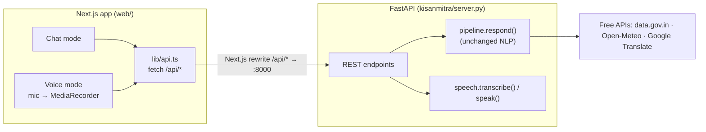
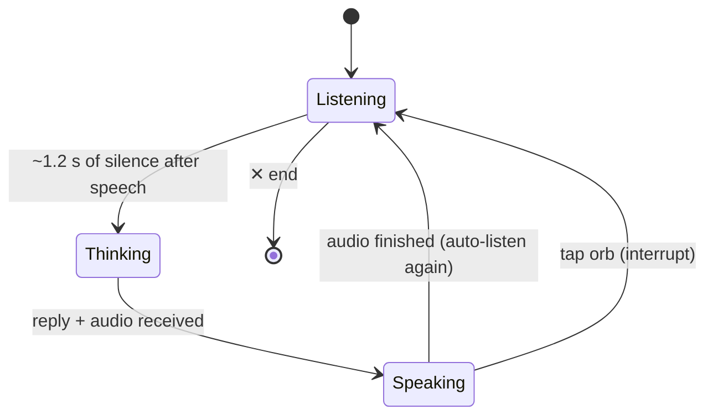

# KisanMitra AI — Frontend Plan (Next.js + shadcn/ui + Magic UI)

> Goal: replace the Streamlit UI with a **ChatGPT-style app** that has a **Chat mode** and a
> full-screen, hands-free **Voice mode**, while keeping the existing Python NLP pipeline unchanged.
> Constraints (from the user): free tools only, keep it reasonably light, use **only shadcn/ui
> components** (plus Magic UI for animation).

---

## 1. Architecture



- **Backend:** a thin FastAPI wrapper (`kisanmitra/server.py`) around the existing `pipeline.respond`, `speech.transcribe` and `speech.speak`. No NLP code changes.
- **Frontend:** Next.js (App Router, TypeScript, Tailwind) in `web/`. A Next.js rewrite proxies `/api/*` to FastAPI on port 8000, so there's no CORS setup.
- **Streamlit `app.py`** is kept as a quick debug UI. It can be deleted later.

### API endpoints

| Method | Path | Input | Output |
|---|---|---|---|
| POST | `/api/chat` | `{text, lang_pref, location}` | `{reply, lang, script, intent, confidence, entities, details, english}` |
| POST | `/api/voice` | multipart `audio` (webm) + `lang_pref`, `location` | `{transcript, heard{lang, prob, engine}, ...chat fields, audio_b64}` |
| POST | `/api/tts` | `{text, lang}` | `audio/mpeg` (for the "🔊 Listen" button on any message) |
| GET | `/api/locations` | — | list of supported districts |
| GET | `/api/health` | — | `{ok, whisper_loaded}` |

`details` already carries structured data (mandi records, weather days), so the UI can show **rich cards** instead of plain text.

---

## 2. Screens

### 2.1 Chat mode (ChatGPT-like)

```
┌──────────────┬───────────────────────────────────────────────────────┐
│ 🌾 KisanMitra │  [Hindi ▾]  [📍 Pune ▾]                     [☀/🌙]  │
│              │                                                       │
│ + New chat   │            नमस्ते 🙏  How can I help your farm today? │
│              │      (greeting rotates: नमस्कार · வணக்கம் · నమస్తే …)  │
│ Today        │                                                       │
│  Tomato…     │   ┌──────────────┐ ┌──────────────┐                   │
│  Onion pr…   │   │🍅 Tomato     │ │💰 Onion price│   suggestion      │
│ Yesterday    │   │ leaves yellow│ │ in Nashik    │   cards           │
│  Rain in…    │   └──────────────┘ └──────────────┘                   │
│              │   ┌──────────────┐ ┌──────────────┐                   │
│              │   │🌧 Rain in    │ │🐛 Pests on   │                   │
│              │   │ Indore?      │ │ cotton       │                   │
│ ──────────── │   └──────────────┘ └──────────────┘                   │
│ ⚙ Settings   │  ┌─────────────────────────────────────────────────┐  │
│ ☎ KCC 1800…  │  │ Ask anything… / कुछ भी पूछें…     🎤  〰️  ➤     │  │
└──────────────┴──┴─────────────────────────────────────────────────┴──┘
                                   🎤 = dictate   〰️ = voice mode
```

- **Sidebar** (collapsible, a sheet on mobile): New chat, chat history saved in `localStorage` and grouped by Today / Yesterday, KCC helpline.
- **Top bar:** reply language select (Auto / हिंदी / मराठी / English / தமிழ் / తెలుగు …), location combobox (searchable), light/dark toggle.
- **Empty state:** a rotating multilingual greeting and 4 suggestion cards in different languages.
- **Messages:** the user bubble is on the right and the assistant is on the left with an avatar. Answers fade in smoothly, and a "thinking" indicator shows while waiting.
- **Rich answers:**
  - 💰 **Price card:** a table of markets with modal/min/max prices, a counting-up number for the main price, and a yellow *Sample data* alert when the live API is down.
  - 🌤 **Weather card:** 3 day tiles (icon, min–max °C, rain % bar) plus farming tips.
  - 🌱 **Advice card:** problem title, steps, and a KCC helpline footer.
- **Message actions:** 🔊 Listen (TTS in the reply language), 📋 Copy, 🧠 **NLP details** (a side sheet showing the language badge, intent + confidence bar, entity badges, English answer and voice info). This is the viva showcase.
- **Composer:** auto-growing textarea, 🎤 dictate (record → transcript fills the box), 〰️ voice mode, ➤ send. Enter sends and Shift+Enter adds a new line.

### 2.2 Voice mode (full screen, like ChatGPT voice)

```
┌────────────────────────────────────────────┐
│                                   [Hindi]  │
│                                            │
│                  ◯◯◯◯◯                    │
│               ◯◯  ORB  ◯◯                 │   orb pulses with mic volume
│                  ◯◯◯◯◯                    │   (listening = green,
│                                            │    thinking = shimmer,
│              "Listening…"                  │    speaking = blue waves)
│   मेरे टमाटर के पत्ते पीले हो रहे हैं         │   live caption: what was heard
│   → टमाटर में संभावित समस्या: अगेती झुलसा…    │   then the spoken answer
│                                            │
│         (🎤 mute)        (✕ end)           │
└────────────────────────────────────────────┘
```

**Hands-free loop:**



- Mic capture uses the browser `MediaRecorder` (webm/opus). Whisper's decoder (PyAV) reads webm directly.
- **Silence detection** uses the Web Audio `AnalyserNode` volume. There's no extra library: when the volume stays below a threshold for about 1.2 s after speech, recording stops automatically.
- The orb size is driven by the live mic volume, so it feels alive.
- Each exchange is also added to the chat thread. When the user closes voice mode, the whole conversation is there as text.
- The first use shows "Loading speech model…" because Whisper loads once (a few seconds).

---

## 3. Components (only shadcn/ui + Magic UI)

| Need | shadcn/ui | Magic UI |
|---|---|---|
| App shell | `sidebar`, `sheet`, `separator`, `scroll-area`, `tooltip` | — |
| Settings | `select`, `popover` + `command` (location combobox), `dropdown-menu`, `switch` | — |
| Messages | `avatar`, `card`, `badge`, `button`, `skeleton` | `blur-fade` (message entry) |
| Empty state | `card` | `word-rotate` (multilingual greeting), `shine-border` (suggestion cards) |
| Rich cards | `table`, `progress`, `alert` | `number-ticker` (price) |
| NLP details | `sheet`, `badge`, `progress`, `collapsible` | — |
| Composer | `textarea`, `button`, `tooltip` | — |
| Voice mode | `dialog` (full screen), `button`, `badge` | `ripple` (orb rings), `shimmer` text for "Thinking…" |
| Feedback | `sonner` (toasts for errors / "API down") | — |

Icons come from `lucide-react` (bundled with shadcn). Light and dark themes use `next-themes`, following the shadcn docs.

---

## 4. Folder structure

```
kisanmitra/server.py          # NEW FastAPI wrapper
web/                          # NEW Next.js app
  app/layout.tsx, page.tsx, globals.css
  components/
    ui/                       # shadcn (generated)
    magicui/                  # Magic UI (generated)
    app-sidebar.tsx
    chat/  chat-view.tsx  message.tsx  composer.tsx  empty-state.tsx
           price-card.tsx  weather-card.tsx  advice-card.tsx  nlp-details-sheet.tsx
    voice/ voice-mode.tsx  voice-orb.tsx
  hooks/ use-recorder.ts  use-silence-detect.ts  use-chats.ts (localStorage)
  lib/   api.ts  types.ts  languages.ts
  next.config.ts              # rewrite /api/* → http://localhost:8000
tests/test_server.py          # NEW API tests (FastAPI TestClient, network mocked)
```

---

## 5. Build phases

| # | Phase | Done when |
|---|---|---|
| 1 | **FastAPI backend** + tests | `/api/chat`, `/api/voice`, `/api/tts` work; `pytest` green |
| 2 | **Scaffold**: `create-next-app`, `shadcn init`, add components, theme, rewrite to API | Blank app runs at `localhost:3000` and calls `/api/health` |
| 3 | **Chat mode**: sidebar, empty state, messages, composer, history | Text questions answered in the UI in any language |
| 4 | **Rich cards + NLP details sheet + Listen button** | Price/weather/advice show as cards; details sheet works |
| 5 | **Dictation + Voice mode** (recorder, silence detection, orb, auto-loop) | Hands-free conversation in Hindi/Marathi/Tamil works end to end |
| 6 | **Polish**: mobile layout, loading/error states, dark/light, README run steps | Works on phone width; API-down states handled |

## 6. How to run (after the build)

```bash
# terminal 1 — backend
uv run uvicorn kisanmitra.server:app --reload --port 8000
# terminal 2 — frontend
cd web && npm install && npm run dev      # open http://localhost:3000
```

## 7. Known limits (be honest in the viva)

- Voice needs **Chrome or Edge** for the most reliable mic recording, and `localhost` or HTTPS for mic permission.
- Speech-to-text uses Google's free recognizer, so it needs internet. Without internet it falls back to Whisper, which is weaker for Telugu and Bengali.
- **Kannada** voice: Whisper "small" misdetected the language in testing. A workaround is picking the language manually in settings.
- The first voice request is slow (Whisper model load, about 5–10 s). After that each answer takes about 2–4 s.
