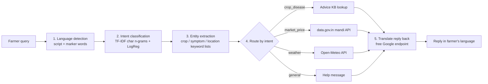

# KisanMitra AI — MVP

> A lightweight, **free-API-only** version of the project that we actually build.
> `plan.md` is the long-term vision. **This file is what we build now.**

## Goal

A farmer types a question in **Hindi, Marathi, English, or romanized Hindi** ("mera tamatar peela ho raha hai") and gets a simple answer **in the same language** about:

1. **Crop problems** (disease / pests) → advice from a small curated knowledge base
2. **Mandi prices** → live government data (Agmarknet via data.gov.in)
3. **Weather** → 3-day forecast + a simple farming tip

## NLP pipeline



| Step | How (MVP) | Why this choice |
|---|---|---|
| Language detection | Unicode script check; Marathi vs Hindi by marker words (`आहे`, `काय`, …); romanized Hindi vs English by Hinglish word list | No model needed, handles romanized Hindi (which `langdetect` gets wrong) |
| Intent | `scikit-learn` TF-IDF (char 2–5 grams) + Logistic Regression trained on `data/intents.csv` | Trains in under 1 second, works across scripts, easy to explain |
| Entities | Keyword lists (`data/crops.json`, `data/locations.json`, symptoms) with spelling variants in all languages | Simple, accurate for the known vocabulary |
| Answer | Rule lookup in `data/advice.json`; live API calls for price and weather | Grounded, no hallucination |
| Translation | Free Google Translate endpoint (no key); also gives romanized output for Hinglish users. MyMemory as fallback | Free |

**4 intents:** `crop_disease`, `market_price`, `weather`, `general`.

## Free APIs used

| API | Use | Key |
|---|---|---|
| [data.gov.in](https://data.gov.in) — Agmarknet daily mandi prices | Prices | Free; a public sample key is built in. Put your own free key in `DATA_GOV_API_KEY` for more results |
| [Open-Meteo](https://open-meteo.com) forecast + geocoding | Weather | None |
| Google Translate (`translate.googleapis.com`, gtx client) | Translation + romanization | None |
| MyMemory | Translation fallback | None |

If the mandi API is down, the app shows **sample offline prices** from `data/mandi_sample.json` and clearly says so. Weather and translation errors also fall back gracefully, to an English answer or a "try again" message.

## Scope

**In the MVP**
- Streamlit chat UI with a language selector (Auto / हिंदी / मराठी / English) and a default location
- The 4 intents above
- About 8 crops, about 40 locations, and a handful of symptoms
- A "Show NLP details" panel (language, intent + confidence, entities). This is useful for the viva
- Unit tests (`pytest`)

**Not in the MVP** (stretch goals, only after the MVP works)
- Voice input/output (`streamlit` mic + gTTS)
- More languages (Telugu, Tamil, …). Other scripts already route through translation
- An IndicBERT intent model to compare against TF-IDF
- A FastAPI backend

## Project layout

```
app.py                 # Streamlit UI
kisanmitra/
  langid.py            # language + script detection
  intent.py            # TF-IDF + LogReg intent classifier
  entities.py          # crop / symptom / location extraction
  advice.py            # crop-problem knowledge-base lookup
  mandi.py             # data.gov.in client (+ offline sample)
  weather.py           # Open-Meteo client + farming tips
  translate.py         # free translation
  pipeline.py          # glues everything together
data/
  intents.csv          # training examples (hi / mr / en / hi-roman)
  crops.json           # crop names + variants + Agmarknet names
  locations.json       # cities/districts + variants + state
  symptoms.json        # symptom keywords
  advice.json          # crop × problem → advice (English)
  mandi_sample.json    # offline fallback prices
tests/
```

## Run

```bash
uv sync
uv run streamlit run app.py
uv run pytest
```

## Demo script

1. `mera tamatar ka paudha peela ho raha hai, kya karu?` → crop advice in romanized Hindi
2. `नाशिक मध्ये कांद्याचा भाव काय आहे?` → mandi price in Marathi
3. `इंदौर में अगले दो दिन बारिश होगी क्या?` → weather + farming tip in Hindi
4. `What is the price of wheat in Indore?` → English
5. Open "Show NLP details" to explain each pipeline step

## Done checklist

- [ ] All 4 intents work in hi, mr, en, and hi-roman
- [ ] Live weather works; live mandi price works (or shows the sample with a notice)
- [ ] Replies come back in the user's language
- [ ] `pytest` passes
- [ ] Intent accuracy is printed on a held-out split (`uv run python -m kisanmitra.intent`)
