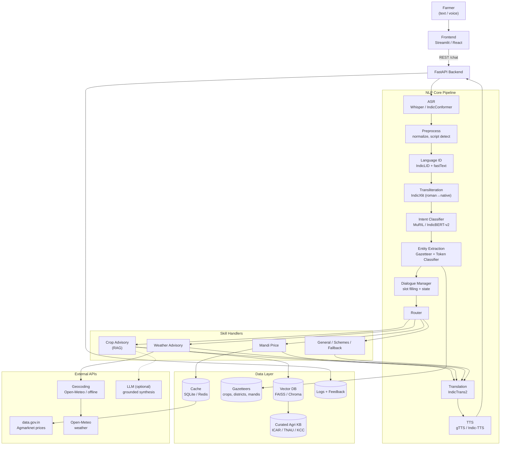
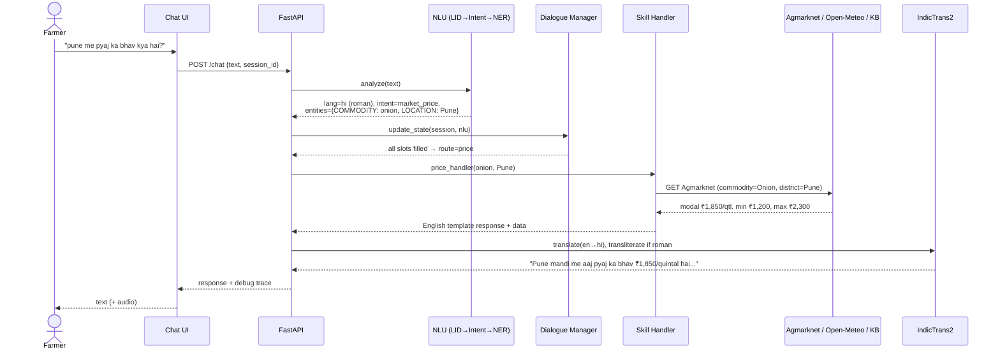
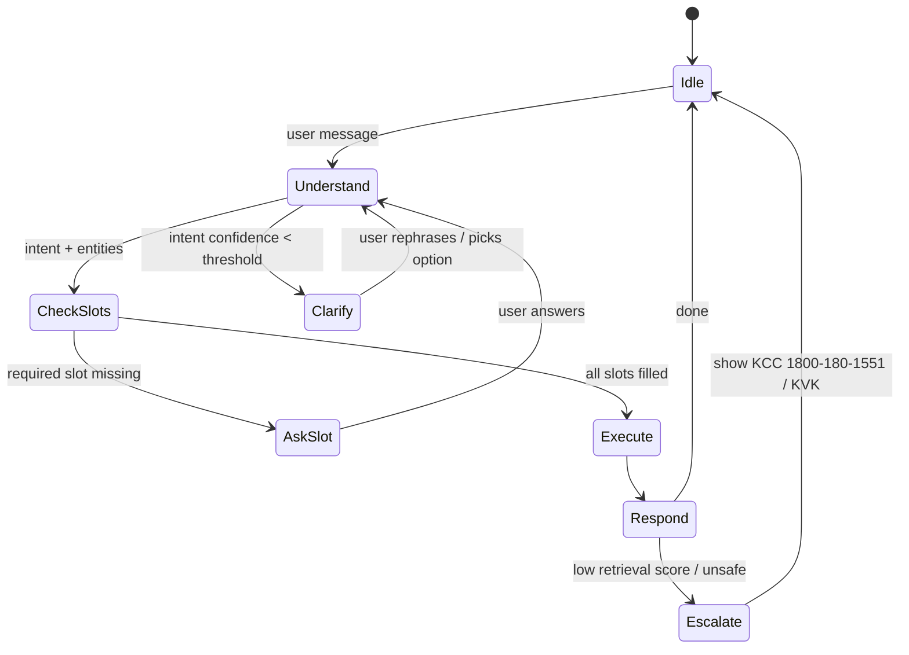
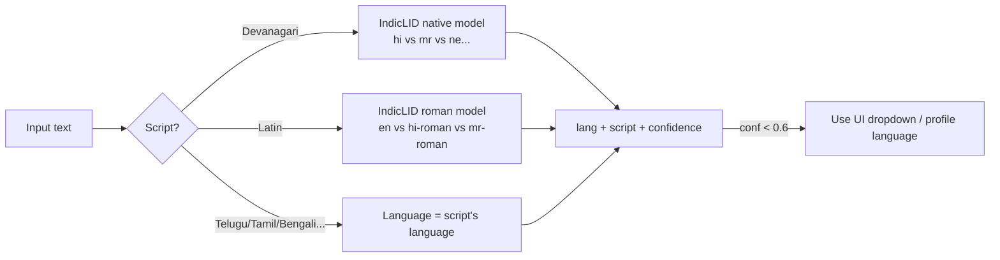
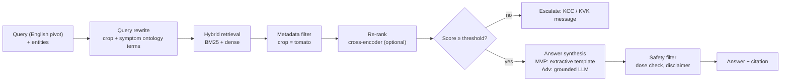
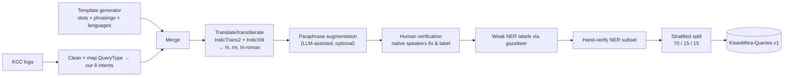
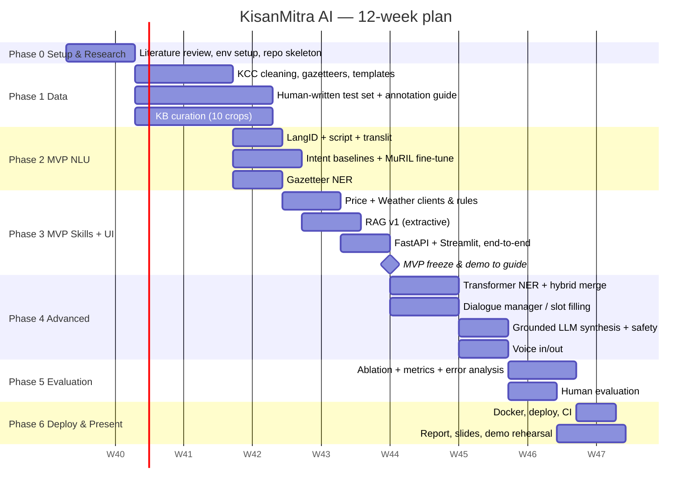
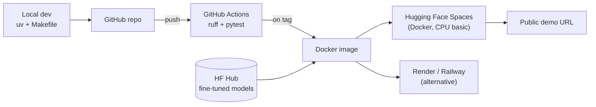

# KisanMitra AI — Project Plan

> **Multilingual NLP Advisory Assistant for Indian Farmers**
> *"Ask in your language, get answers that matter — crop care, weather, and mandi prices for every Indian farmer."*

This document is the **single source of truth** for the project: idea → research → development → testing → deployment → final presentation. Update it whenever a decision changes. Do not keep project decisions anywhere else.

---

## Table of Contents

1. [Executive Summary](#1-executive-summary)
2. [Problem Statement & Motivation](#2-problem-statement--motivation)
3. [What We Improved Over the Original Idea](#3-what-we-improved-over-the-original-idea)
4. [Objectives](#4-objectives)
5. [Scope: MVP vs Advanced vs Production](#5-scope-mvp-vs-advanced-vs-production)
6. [Key Features](#6-key-features)
7. [System Architecture](#7-system-architecture)
8. [NLP / ML Approach (Module by Module)](#8-nlp--ml-approach-module-by-module)
9. [Datasets & Data Strategy](#9-datasets--data-strategy)
10. [External APIs](#10-external-apis)
11. [Tech Stack](#11-tech-stack)
12. [Folder Structure](#12-folder-structure)
13. [API Contract](#13-api-contract)
14. [Implementation Phases & Timeline](#14-implementation-phases--timeline)
15. [Testing & Evaluation](#15-testing--evaluation)
16. [Deployment](#16-deployment)
17. [Risks & Mitigations](#17-risks--mitigations)
18. [Ethics, Safety & Responsible AI](#18-ethics-safety--responsible-ai)
19. [Expected Results](#19-expected-results)
20. [Future Scope](#20-future-scope)
21. [Final Demo & Viva Strategy](#21-final-demo--viva-strategy)
22. [Definition of Done Checklist](#22-definition-of-done-checklist)
23. [References](#23-references)

---

## 1. Executive Summary

KisanMitra AI is a conversational assistant that lets a farmer ask a question **in their own language and script, by text or voice**. Examples include Hindi in Devanagari, *romanized* Hindi ("Hinglish") and Marathi. The assistant answers in the same language with:

- **Crop-care advice** (disease/pest symptoms → likely cause → remedy), grounded in a curated agricultural knowledge base with sources
- **Live mandi (market) prices** from the Government of India's Agmarknet data (via data.gov.in)
- **Location-aware weather forecasts** with simple farming advice (e.g. "rain expected in 2 days, postpone spraying")

The NLP core is a modular pipeline with these stages:

1. Language and script identification
2. Transliteration and normalization
3. Multilingual intent classification
4. Agricultural named entity recognition
5. Dialogue state tracking (it asks a follow-up if the crop or location is missing)
6. Retrieval-augmented response generation
7. Translation back into the user's language

Every stage is **measured** with standard metrics, and the main design choice (translate-first vs. native multilingual) is tested with an **ablation study**. That gives the project academic depth beyond a demo.

---

## 2. Problem Statement & Motivation

- India has **~14 crore (140M) farm holdings** (Agriculture Census). Most farmers are far more comfortable in Hindi, Marathi, Telugu, Tamil, etc. than in English.
- Many rural users **type in romanized script** ("mera tamatar peela ho raha hai") because phone keyboards default to Latin. Most Indic NLP tools assume native script, so they fail here.
- Existing agri-advisory apps are often English-first, menu-heavy and assume app literacy.
- The **Kisan Call Centre (KCC)** gets millions of calls a year, and its logs show that the same few query types (pest/disease, weather, market price, fertilizer, government schemes) dominate. That is a natural fit for automated intent understanding.

**Problem statement:**
> Build a multilingual, code-mix-aware NLP system that understands free-form farmer queries in Indian languages (text or speech), extracts the intent and key agricultural entities, and replies in the farmer's language with accurate, grounded, actionable advice, including live weather and market data.

---

## 3. What We Improved Over the Original Idea

| Original idea | Problem with it | Improvement in this plan |
|---|---|---|
| `fasttext lid.176` / `langdetect` for language ID | Fails on **romanized** Hindi/Marathi (labels it English or Indonesian) and confuses Hindi vs Marathi (both Devanagari) | **Two-stage LID**: Unicode script detection → **IndicLID** (AI4Bharat, supports romanized Indic) with fastText as fallback |
| Translate everything to English, then classify | Translation errors propagate; slow | **Native multilingual intent classifier** (MuRIL / IndicBERT-v2) on original text. Translate-first is kept as a **baseline for an ablation study** |
| NER "crop, symptom, location" | No public Indic agricultural NER dataset exists | **Hybrid NER**: multilingual gazetteers (crop/district lexicons) + fine-tuned token classifier trained on **weakly-labelled + hand-verified** data |
| Single-turn Q&A | Real queries are incomplete ("price kya hai?" — of what? where?) | **Slot-filling dialogue manager** that asks a follow-up in the user's language |
| Rule-based responses / "small RAG" | Canned answers don't scale; ungrounded LLM output can be dangerous (wrong pesticide dose) | **Grounded RAG** with citations + safety guardrails + "consult your local KVK" escalation |
| IMD weather API | IMD API access needs IP whitelisting/registration and is unreliable for students | **Open-Meteo** (free, no key) as primary; IMD as optional |
| Agmarknet API | No direct public REST API; scraping the portal is fragile | **data.gov.in OGD API** for the Agmarknet daily mandi price dataset (free API key), plus a local cache |
| 4 intents | Too coarse for real queries | **8 intents** derived from real KCC query categories (Section 8.4) |
| No evaluation plan | Hard to defend in viva | Per-module metrics, ablation, latency, and a **human evaluation** with native speakers |

**The novelty in one line:** a *code-mix-aware*, *grounded*, *slot-filling* agricultural assistant, plus an empirical comparison of translate-first vs. native multilingual understanding on real farmer queries.

---

## 4. Objectives

### 4.1 Primary objectives
1. Identify language **and script** of a query (native + romanized) for at least Hindi, Marathi, and English.
2. Classify farmer intent into 8 categories with **macro-F1 ≥ 0.85** on a held-out test set.
3. Extract agricultural entities (CROP, DISEASE/SYMPTOM, PEST, LOCATION, COMMODITY, DATE/TIME) with **entity-level F1 ≥ 0.75**.
4. Answer crop-care questions using **retrieval-grounded** responses with source citations.
5. Fetch and present **live mandi prices** and **weather forecasts** for the farmer's location.
6. Respond in the user's **original language** (and script where possible).

### 4.2 Secondary objectives
7. Voice input (speech-to-text) and voice output (text-to-speech) for low-literacy users.
8. Multi-turn conversations with slot filling and context carry-over.
9. Publish an evaluation report with an ablation study and human evaluation.
10. Deploy a publicly accessible demo.

### 4.3 Learning objectives (for the course)
- Hands-on with transformer fine-tuning (sequence + token classification)
- Multilingual / low-resource NLP, transliteration, code-mixing
- Information retrieval & RAG, evaluation methodology
- Building and deploying an end-to-end NLP system

---

## 5. Scope: MVP vs Advanced vs Production


### 5.1 MVP — must ship (guaranteed demo)

| Area | MVP scope |
|---|---|
| Languages | Hindi (Devanagari + romanized), Marathi (Devanagari), English |
| Input | Text only |
| Language ID | Script detection + IndicLID/fastText; manual override dropdown |
| Intent | Fine-tuned **MuRIL** or **IndicBERT-v2** classifier, 8 intents |
| NER | Gazetteer + regex + fuzzy matching (crop, location, commodity) |
| Crop advice | Retrieval over a curated KB of **~10 crops × common diseases/pests** (~150–300 passages); return the best passage, translated |
| Mandi prices | data.gov.in Agmarknet API, filtered by commodity + state/district |
| Weather | Open-Meteo 7-day forecast + rule-based farming tips |
| Translation | IndicTrans2 (distilled 200M) for en↔indic |
| UI | Streamlit chat |
| Eval | Intent F1, NER F1, LID accuracy, retrieval Recall@k |

### 5.2 Advanced — strongly recommended (makes it impressive)

| Area | Advanced scope |
|---|---|
| NER | Fine-tuned token classifier (MuRIL/IndicBERT) on weakly-labelled + verified data, merged with gazetteer |
| Dialogue | Slot-filling state machine with follow-up questions; context carry-over across turns |
| Generation | Grounded LLM answer synthesis from retrieved passages, with citations and a safety filter |
| Voice | ASR: Whisper (small/medium) or AI4Bharat IndicConformer; TTS: gTTS or AI4Bharat Indic-TTS |
| Languages | + Telugu, Tamil, Bengali, Gujarati, Punjabi (pipeline is language-agnostic; mostly data work) |
| Proactive tips | Weather-aware advisories (spray window, irrigation, frost/heat alerts) |
| Research | Ablation: translate-first vs native; LID on romanized text; human evaluation |
| UI | React (or polished Streamlit) chat with mic button, price table, weather card |

### 5.3 Production-ready — final / future

| Area | Production scope |
|---|---|
| Packaging | Docker + docker-compose, env-based config, CI (GitHub Actions) |
| Performance | ONNX/int8 quantized models, response caching, async API calls |
| Reliability | API fallbacks + cached data, timeouts, structured logging |
| Observability | Request logs, latency per stage, low-confidence query log |
| Feedback | 👍/👎 + correction capture → retraining set (active learning) |
| Channels | WhatsApp bot (Twilio/Meta Cloud API) / IVR for feature phones |
| Vision | Leaf photo → disease classifier (PlantVillage-trained CNN/ViT) feeding the same RAG |

> **Rule:** Never start an Advanced item until every MVP item is green in the [Definition of Done](#22-definition-of-done-checklist).

---

## 6. Key Features

1. **Speak or type in your language.** Hindi, Marathi, and English at MVP. Romanized/code-mixed input works ("tamatar me keede lag gaye").
2. **Smart understanding.** Detects *what* you want (intent) and *about what* (crop, pest, place).
3. **Crop doctor.** Symptom → likely problem → organic and chemical remedies, with a source and a safety note.
4. **Mandi bhav.** Today's modal/min/max price for a commodity at nearby mandis, plus a short trend.
5. **Mausam salah (weather advice).** 7-day forecast with farming actions ("avoid spraying, rain tomorrow").
6. **Asks when unclear.** "Aap kis jile se hain?" ("Which district are you from?") when the location is missing.
7. **Same-language replies.** Replies come back in the user's language and script, optionally as voice.
8. **Transparent.** Each advice answer shows its source and a confidence level. Low-confidence answers point the farmer to the Kisan Call Centre (1800-180-1551) or the local KVK.
9. **Explainability panel (demo mode).** Shows the pipeline internals for each query: detected language, intent + confidence, entities, retrieved passages, and latency per stage. This is very useful for the viva.

---

## 7. System Architecture

### 7.1 High-level architecture



### 7.2 Request flow (sequence)



### 7.3 Dialogue state machine



**Required slots per intent:**

| Intent | Required slots | Optional slots |
|---|---|---|
| `crop_disease` | CROP, SYMPTOM or DISEASE | CROP_STAGE, LOCATION |
| `pest_control` | CROP, PEST or SYMPTOM | — |
| `market_price` | COMMODITY | LOCATION (default: user profile state) |
| `weather` | LOCATION | DATE |
| `fertilizer_nutrient` | CROP | CROP_STAGE, SOIL |
| `sowing_cultivation` | CROP | LOCATION, SEASON |
| `govt_scheme` | — | SCHEME name |
| `general_greeting_other` | — | — |

---

## 8. NLP / ML Approach (Module by Module)

### 8.1 Preprocessing & normalization
- Unicode NFC normalization; remove zero-width joiners where harmful; normalize Devanagari nukta and numerals (०-९ → 0-9).
- **Script detection** by Unicode block ratios: Devanagari, Telugu, Tamil, Bengali, Gujarati, Gurmukhi, Latin.
- Light spell normalization for romanized text using common variants (e.g. `kya/kia`, `pyaj/pyaaz/pyaz`) through a variant dictionary.
- Library: **IndicNLP Library** for normalization and tokenization.

### 8.2 Language identification (two-stage)



- **Primary:** AI4Bharat **IndicLID** (covers 22 languages in native + romanized form).
- **Fallback:** fastText `lid.176.ftz` for non-Indic text.
- **Evaluation:** accuracy and confusion matrix on our test set, reported separately for native vs. romanized input. Expect hi↔mr confusion on short inputs. The fix is the UI language preference used as a prior.

### 8.3 Transliteration
- Romanized Indic → native script using **IndicXlit** (AI4Bharat) before translation or NER. That way gazetteers and models only need native-script coverage.
- On output, if the user wrote in roman script, transliterate the native reply **back to roman script**, because users read the script they write in.

### 8.4 Intent classification

**Intent taxonomy** (derived from Kisan Call Centre query categories):

| # | Intent | Example (hi-roman / hi / mr / en) |
|---|---|---|
| 1 | `crop_disease` | "tamatar ke patte peele ho rahe hai" |
| 2 | `pest_control` | "कपास में गुलाबी सुंडी लगी है" |
| 3 | `fertilizer_nutrient` | "गव्हासाठी किती युरिया टाकावा?" |
| 4 | `market_price` | "pune me pyaj ka bhav" |
| 5 | `weather` | "Will it rain in Nashik this week?" |
| 6 | `sowing_cultivation` | "soybean ki buvai kab kare?" |
| 7 | `govt_scheme` | "PM Kisan ka paisa kab aayega?" |
| 8 | `greeting_other` | "namaste", "thank you", out-of-domain |

**Approach:**
- **Model A (main):** fine-tune **`google/muril-base-cased`** (it was trained on transliterated Indic text, so it handles romanized input well) for sequence classification. Compare with **`ai4bharat/IndicBERTv2-MLM-only`**.
- **Model B (baseline 1):** TF-IDF (char n-grams 2–5) + Logistic Regression / Linear SVM. This is fast, strong on short text, and must be reported.
- **Model C (baseline 2, ablation):** translate to English with IndicTrans2, then classify with an English model (e.g. DistilBERT/`bert-base-uncased` fine-tuned on English versions).
- **Training details:**
  - max_len 64
  - lr 2e-5 to 5e-5
  - 3–5 epochs
  - weighted cross-entropy for class imbalance
  - early stopping on dev macro-F1
- **Confidence handling:** softmax max < τ (tuned on dev, ~0.5) → `Clarify` state. Optional temperature scaling for calibration.
- **Out-of-domain detection:** `greeting_other` class + a confidence threshold.

### 8.5 Named Entity Recognition (agricultural)

**Entity types:** `CROP`, `DISEASE`, `PEST`, `SYMPTOM`, `LOCATION` (state/district/mandi), `COMMODITY`, `FERTILIZER`, `DATE_TIME`, `QUANTITY`.

**Hybrid approach:**
1. **Gazetteer matcher (MVP):**
   - Multilingual lexicons: crop names in en/hi/mr plus romanized variants (`tamatar`, `टमाटर`, `टोमॅटो`, `tomato` → `CROP:tomato`).
   - Districts and mandis come from the Agmarknet/LGD lists.
   - Matching uses **Aho-Corasick** and **fuzzy matching** (RapidFuzz, threshold ~85) for spelling variants.
   - Each match is normalized to a **canonical English ID**, which the downstream APIs use.
2. **Token classifier (Advanced):**
   - Fine-tune MuRIL for token classification (BIO tags).
   - Training data comes from **weak labelling**: run the gazetteer + regex over KCC queries and synthetic templates, then **hand-verify ~600–1000 sentences** (the gold set).
3. **Merge strategy:**
   - Use model spans where confidence is high, gazetteer spans otherwise.
   - Map every span to a canonical ID through the gazetteer, so the model finds spans and the gazetteer normalizes them.
4. **Symptom normalization:** map free-text symptoms ("patte peele", "पत्ते पीले", "yellow leaves") to a small symptom ontology (`leaf_yellowing`, `leaf_spots`, `wilting`, `fruit_rot`, …) for better retrieval.

**Evaluation:** entity-level precision/recall/F1 with `seqeval` (strict match). Report gazetteer-only vs model vs hybrid.

### 8.6 Dialogue manager
- Session state is held in memory or SQLite, keyed by `session_id`: `{lang, script, intent, slots, history[-5:]}`.
- **Context carry-over:** "aur Nashik me?" ("and in Nashik?") after a price query keeps `intent=market_price` and `COMMODITY=onion` and only updates `LOCATION`.
- Follow-up question templates are written per language and slot (not machine-translated, for quality).

### 8.7 Response generation per skill

#### a) Crop Advisory (RAG)



- **Knowledge base:** Curated, chunked passages (150–300 words) with metadata `{crop, problem, type: disease/pest/nutrient, source, url, language}`. Sources are listed in Section 9.
- **Embeddings:** `BAAI/bge-m3` or `intfloat/multilingual-e5-base`. Both are multilingual, so Hindi queries can retrieve English passages directly. Compare this with translate-then-retrieve.
- **Vector store:** FAISS (simple, local) or ChromaDB (metadata filtering built in).
- **Hybrid retrieval:** BM25 (`rank_bm25`) and dense scores fused with Reciprocal Rank Fusion.
- **Synthesis:**
  - *MVP:* fill a structured template from the top passage: **Problem → Symptoms → What to do now → Organic option → Chemical option (with dose) → Prevention**.
  - *Advanced:* send the top-3 passages to an LLM with a strict grounded prompt: "answer only from context, cite [n], use simple words, say *I'm not sure* if the context lacks the answer". The generated answer is then checked by the safety filter.
- **Why an LLM is optional:** the system must work fully offline/free with the extractive template. The LLM only improves fluency, and a config flag controls it.

#### b) Mandi Price
- Map the `COMMODITY` canonical ID to Agmarknet commodity names (e.g. `onion` → `Onion`).
- Query data.gov.in with filters `state`, `district`, `commodity`. If nothing is found for the district, fall back to the state, then to the nearest mandis.
- Return **modal / min / max price (₹/quintal)**, market name and arrival date. If cached history exists, add a 7-day trend ("↑ 6% vs last week").
- Cache responses for 6 hours (prices update daily).

#### c) Weather Advisory
- Geocode `LOCATION` (offline district → lat/lon table, with the Open-Meteo geocoding API as fallback).
- Fetch the Open-Meteo forecast: precipitation, temperature max/min, wind and humidity for 7 days.
- A **rule engine** produces farming advice, for example:
  - rain > 5 mm in the next 48h → "Postpone spraying and fertilizer application"
  - Tmax > 40°C → "Irrigate in the evening; heat stress risk"
  - humidity > 85% for 3+ days → "High fungal disease risk; monitor for blight"
  - wind > 15 km/h → "Avoid spraying (drift)"

#### d) General / Govt schemes / Fallback
- A small FAQ retrieval set (PM-KISAN, PMFBY crop insurance, Soil Health Card, KCC loan) with official links.
- Out-of-domain or low confidence → polite fallback plus the Kisan Call Centre number **1800-180-1551**.

### 8.8 Translation
- **IndicTrans2** (AI4Bharat). Use the distilled checkpoints `indictrans2-indic-en-dist-200M` and `indictrans2-en-indic-dist-200M` to keep CPU latency reasonable.
- **Where translation is used:**
  - Generated advice and LLM output (en → user lang).
  - Translate-first baseline experiments (indic → en).
- **Where it is NOT used:**
  - Intent and NER: native multilingual models.
  - Fixed UI strings, follow-up questions and price/weather templates: these are **pre-written per language**, which is faster and more accurate.
- **Protect entities and numbers:** replace prices, crop names and chemical names with placeholders before translation and restore them afterwards. This prevents mistranslating "Mancozeb 2.5 g/L".

### 8.9 Speech (Advanced)
- **ASR:**
  - `openai/whisper-small` (multilingual) for a quick start.
  - Compare with AI4Bharat **IndicConformer** / IndicWhisper (better WER on Indian languages).
  - Report WER on ~50 recorded test utterances.
- **TTS:** `gTTS` (simple, online) or AI4Bharat **Indic Parler-TTS** / Indic-TTS (offline, more natural).

---

## 9. Datasets & Data Strategy

### 9.1 Sources

| Dataset / source | Use | Notes |
|---|---|---|
| **Kisan Call Centre (KCC) query logs** — data.gov.in | Intent training data, real query phrasing, KB Q&A pairs | Real farmer queries with `QueryType`, `Crop`, `State`, `KccAns`. Mostly English/roman summaries written by call agents; needs cleaning |
| **ICAR / State Agri University package-of-practices** | KB passages (disease, pest, nutrient management) | Authoritative; manually chunk ~10 crops |
| **TNAU Agritech Portal** | KB passages: crop protection pages | Well structured by crop → pest/disease |
| **Agmarknet (via data.gov.in)** | Live prices + commodity/market lists for the gazetteer | Free API key from data.gov.in |
| **LGD / Census district lists** | LOCATION gazetteer | State & district names; add hi/mr names |
| **AI4Bharat resources** (IndicCorp, Aksharantar, Samanantar) | Transliteration variants, optional augmentation | Aksharantar is great for romanized variants |
| **PlantVillage** (Kaggle) | Disease name list for gazetteer; future image module | Images not needed for MVP |
| **Self-created multilingual query set** | Main train/dev/test for intent + NER | See 9.2 |

### 9.2 Building our own labelled dataset (the core data contribution)



**Target size (v1):**

| Split | Intent examples | NER-annotated sentences |
|---|---|---|
| Train | ~4,000–6,000 (all langs) | ~700 |
| Dev | ~800 | ~150 |
| Test (**human-written only, no synthetic**) | ~600 (≥150 per language incl. hi-roman) | ~150 |

**Rules:**
- **The test set must be human-written** (by classmates, family, or actual farmers if possible) and never machine-generated. Otherwise the metrics are inflated. This is a key viva point.
- Keep the language and intent distribution balanced, and store `lang`, `script`, and `source` (kcc / template / human) on every row.
- Annotation tool: **Label Studio** or **doccano**. Write a 1-page annotation guideline with examples per entity type. If two annotators are available, report inter-annotator agreement (Cohen's κ) on 100 shared samples.
- Version the data (`data/processed/v1/...`) and document it in `data/README.md` with a datasheet (source, license, size, language split).

### 9.3 Knowledge base scope (MVP)
- **10 crops:** tomato, potato, onion, rice, wheat, cotton, soybean, sugarcane, chilli, maize.
- **Per crop:** the top 3–5 diseases/pests, plus 1 nutrient/fertilizer passage.
- **Size:** about 150–300 passages, each with source URL metadata.
- **Advanced:** add KCC Q&A pairs (filtered to high quality) as additional retrievable passages.

---

## 10. External APIs

| API | Purpose | Auth | Fallback |
|---|---|---|---|
| data.gov.in OGD — *"Current Daily Price of Various Commodities from Various Markets (Mandi)"* | Mandi prices | Free API key (`DATA_GOV_API_KEY`) | Last cached response + "as of <date>" |
| Open-Meteo Forecast | Weather | None | Cached forecast; IMD optional |
| Open-Meteo Geocoding | Location → lat/lon | None | Offline district centroid CSV |
| LLM API (optional, Advanced) | Grounded answer synthesis | API key in `.env` | Extractive template answer |

All external calls:
- go through `httpx` with timeouts (3–5 s) and retries (`tenacity`)
- are cached in SQLite/`diskcache`, so the **demo never breaks because of the network**

API keys live only in `.env`, which is git-ignored.

---

## 11. Tech Stack

| Layer | Choice | Why |
|---|---|---|
| Language | **Python 3.11** | Best compatibility with torch, fastText, IndicTrans2, and ctranslate2. The repo currently pins 3.13; **downgrade `.python-version` to 3.11** to avoid wheel issues |
| Package mgmt | **uv** (already used) | Fast, lockfile |
| ML / NLP | PyTorch, HF `transformers`, `datasets`, `evaluate`, `seqeval`, `scikit-learn` | Standard |
| Indic NLP | IndicTrans2, IndicLID, IndicXlit, IndicNLP Library, MuRIL / IndicBERT-v2 | Best open Indic tooling |
| Retrieval | `sentence-transformers` (bge-m3 / multilingual-e5), FAISS or ChromaDB, `rank_bm25` | Simple, local |
| Matching | `pyahocorasick`, `rapidfuzz` | Fast gazetteer + fuzzy |
| Speech | Whisper / IndicConformer, gTTS / Indic-TTS | Voice |
| Backend | **FastAPI**, Pydantic, `httpx`, `tenacity`, `diskcache` | Async, typed |
| Frontend | **Streamlit** (MVP) → React + Vite + Tailwind (optional advanced) | Speed first |
| Storage | SQLite (sessions, cache, feedback) | Zero-ops |
| Experiment tracking | Weights & Biases or MLflow (free) | Reproducible results for the report |
| Training compute | Google Colab / Kaggle (free T4 GPU) | Fine-tuning base models takes ~10–30 min |
| Testing | `pytest`, `pytest-asyncio`, `httpx` test client | — |
| Quality | `ruff` (lint + format), `pre-commit` | — |
| Deploy | Docker, Hugging Face Spaces (Streamlit/Docker) or Render/Railway | Free tiers |
| CI | GitHub Actions (lint + unit tests) | — |

---

## 12. Folder Structure

```
nlp-project/
├── plan.md                      # ← this file (single source of truth)
├── README.md                    # setup + run instructions
├── pyproject.toml               # uv project, deps
├── .python-version              # 3.11
├── .env.example                 # DATA_GOV_API_KEY=, LLM_API_KEY=, ...
├── .gitignore                   # .env, data/raw, models/, *.ckpt, .venv
├── Dockerfile
├── docker-compose.yml
├── Makefile                     # make setup / train / eval / serve / ui / test
│
├── configs/
│   ├── app.yaml                 # thresholds, enabled langs, feature flags (use_llm, use_voice)
│   ├── intent_train.yaml
│   └── ner_train.yaml
│
├── data/
│   ├── README.md                # datasheet: sources, licenses, stats
│   ├── raw/                     # KCC dumps, scraped KB pages (git-ignored)
│   ├── interim/                 # cleaned / translated intermediates
│   ├── processed/v1/            # intent_{train,dev,test}.jsonl, ner_*.jsonl
│   ├── gazetteers/              # crops.csv, districts.csv, mandis.csv, symptoms.csv, variants.csv
│   ├── kb/                      # curated passages (jsonl) + source list
│   └── templates/               # per-language response & follow-up templates (yaml)
│
├── notebooks/                   # EDA, Colab training notebooks, error analysis
│   ├── 01_eda_kcc.ipynb
│   ├── 02_train_intent.ipynb
│   ├── 03_train_ner.ipynb
│   └── 04_error_analysis.ipynb
│
├── src/kisanmitra/
│   ├── __init__.py
│   ├── config.py                # loads configs/app.yaml + env
│   ├── pipeline.py              # orchestrates the full NLU → skill → NLG flow
│   ├── schemas.py               # Pydantic models (Request, NLUResult, Response, Trace)
│   ├── nlu/
│   │   ├── normalize.py
│   │   ├── script.py
│   │   ├── langid.py
│   │   ├── transliterate.py
│   │   ├── intent.py
│   │   ├── ner_gazetteer.py
│   │   ├── ner_model.py
│   │   └── ner.py               # hybrid merge + canonicalization
│   ├── dialogue/
│   │   ├── state.py
│   │   └── manager.py
│   ├── skills/
│   │   ├── base.py
│   │   ├── advisory.py          # RAG
│   │   ├── price.py
│   │   ├── weather.py
│   │   └── general.py
│   ├── retrieval/
│   │   ├── build_index.py
│   │   ├── retriever.py         # BM25 + dense + RRF
│   │   └── reranker.py
│   ├── nlg/
│   │   ├── templates.py
│   │   ├── translate.py         # IndicTrans2 wrapper with entity protection
│   │   ├── llm.py               # optional grounded synthesis
│   │   └── safety.py
│   ├── speech/
│   │   ├── asr.py
│   │   └── tts.py
│   ├── clients/
│   │   ├── agmarknet.py
│   │   ├── openmeteo.py
│   │   └── cache.py
│   └── api/
│       ├── main.py              # FastAPI app
│       └── routes.py
│
├── training/
│   ├── prepare_data.py          # KCC cleaning, templates, splits
│   ├── weak_label_ner.py
│   ├── train_intent.py
│   ├── train_ner.py
│   └── baselines.py             # TF-IDF + LR, translate-first
│
├── evaluation/
│   ├── eval_langid.py
│   ├── eval_intent.py
│   ├── eval_ner.py
│   ├── eval_retrieval.py
│   ├── eval_e2e.py              # golden conversation set
│   ├── human_eval/              # forms + results
│   └── reports/                 # generated tables/plots for the report
│
├── models/                      # downloaded/fine-tuned weights (git-ignored; pushed to HF Hub)
│
├── ui/
│   ├── streamlit_app.py
│   └── react/                   # optional advanced frontend
│
├── tests/
│   ├── unit/                    # normalize, script, gazetteer, slot logic, rules
│   ├── integration/             # pipeline with mocked APIs
│   ├── api/                     # FastAPI endpoints
│   └── fixtures/                # sample queries, mocked API JSON
│
└── docs/
    ├── report/                  # final project report (LaTeX/Docx)
    ├── slides/
    ├── diagrams/
    └── demo_script.md
```

---

## 13. API Contract

### `POST /chat`
```json
// request
{
  "session_id": "abc123",
  "text": "mera tamatar ka paudha peela ho raha hai, kya karu?",
  "lang_hint": "hi",          // optional (UI dropdown / profile)
  "location_hint": "Pune",    // optional (profile)
  "debug": true
}
```
```json
// response
{
  "reply": "Aapke tamatar ke paudhe me ... (Source: ICAR-IIHR)",
  "lang": "hi",
  "script": "latin",
  "intent": {"label": "crop_disease", "confidence": 0.93},
  "entities": [
    {"type": "CROP", "text": "tamatar", "canonical": "tomato"},
    {"type": "SYMPTOM", "text": "peela", "canonical": "leaf_yellowing"}
  ],
  "follow_up": null,
  "sources": [{"title": "Tomato: Early blight", "url": "..."}],
  "audio_url": null,
  "trace": {"latency_ms": {"langid": 8, "intent": 35, "ner": 20, "retrieval": 60, "translate": 400}}
}
```

### Other endpoints
| Method | Path | Purpose |
|---|---|---|
| POST | `/voice` | multipart audio → same response as `/chat` + `audio_url` |
| POST | `/feedback` | `{session_id, message_id, rating, correction}` |
| GET | `/price?commodity=onion&district=Pune` | direct skill call (debug) |
| GET | `/weather?location=Nashik` | direct skill call (debug) |
| GET | `/health` | liveness + model-loaded status |

---

## 14. Implementation Phases & Timeline

Assumes **~12 weeks** with a team of 2–4. With a solo developer, extend the timeline or trim the Advanced scope.



### Phase details & deliverables

**Phase 0 — Setup & research (Week 1)**
- [ ] Set Python 3.11 in `.python-version`, run `uv add` for core deps, create the folder skeleton, `ruff`, `pre-commit`, and `.env.example`
- [ ] Get a data.gov.in API key; test the Agmarknet and Open-Meteo calls in a notebook
- [ ] Download and smoke-test IndicTrans2-dist, IndicLID, IndicXlit, and MuRIL on CPU (note latency)
- [ ] Literature review: 6–8 papers (see References) → 1-page summary for the report
- **Deliverable:** repo skeleton, tool smoke-test notebook, literature notes

**Phase 1 — Data (Weeks 2–3)**
- [ ] Clean KCC logs and map `QueryType` → 8 intents; produce EDA plots (query type distribution, top crops, states)
- [ ] Build the gazetteers: crops (en/hi/mr/roman variants), districts, mandis, symptoms ontology
- [ ] Template generator + translation/transliteration → train/dev data
- [ ] Collect the **human-written test set** (Google Form to classmates/family, by language)
- [ ] Curate the KB: 10 crops × diseases/pests, chunked JSONL with metadata
- **Deliverable:** `data/processed/v1`, `data/gazetteers`, `data/kb`, `data/README.md` datasheet

**Phase 2 — MVP NLU (Weeks 3–4)**
- [ ] `normalize`, `script`, `langid` (IndicLID + fallback), `transliterate`
- [ ] Intent: TF-IDF+LR baseline → MuRIL fine-tune on Colab → push to HF Hub (private) → load in the app
- [ ] Gazetteer NER with canonicalization
- [ ] Unit tests for all of the above
- **Deliverable:** `nlu/` package with metrics: LID accuracy, intent macro-F1, NER F1 (gazetteer)

**Phase 3 — MVP skills + UI (Weeks 4–5)**
- [ ] Agmarknet & Open-Meteo clients with caching and fallbacks; weather rule engine
- [ ] RAG v1: build the index (bge-m3/e5 + BM25), retrieval, extractive template answer
- [ ] IndicTrans2 wrapper with entity/number protection
- [ ] FastAPI `/chat` plus a Streamlit chat with language dropdown and debug panel
- **Milestone: MVP freeze.** A complete demo in hi, mr, en and hi-roman. Show it to the guide and collect feedback.

**Phase 4 — Advanced (Weeks 6–9)**
- [ ] Weak-label NER data → hand-verify → fine-tune MuRIL token classifier → hybrid merge
- [ ] Dialogue manager: slot filling, follow-ups, context carry-over
- [ ] Grounded LLM synthesis behind a feature flag; safety filter (pesticide dose sanity, disclaimers)
- [ ] Voice: ASR + TTS endpoints, mic button in the UI
- [ ] Add 1–3 more languages (Telugu/Tamil/Gujarati) if time allows
- **Deliverable:** Advanced features behind flags; the MVP still works with all flags off

**Phase 5 — Evaluation (Weeks 9–10)**
- [ ] Run all eval scripts and generate tables/plots in `evaluation/reports/`
- [ ] **Ablation:** native vs translate-first (intent F1, latency), dense vs BM25 vs hybrid retrieval, gazetteer vs model vs hybrid NER
- [ ] Error analysis: confusion matrices, 30 failure cases categorized
- [ ] Human eval: 5–10 native speakers rate 40 responses (Section 15.4)
- **Deliverable:** results chapter of the report

**Phase 6 — Deployment & presentation (Weeks 11–12)**
- [ ] Dockerize, deploy to HF Spaces/Render, set up GitHub Actions CI
- [ ] Final report, slides, recorded backup demo video, viva Q&A prep
- **Deliverable:** public URL, report, slides, demo video

---

## 15. Testing & Evaluation

### 15.1 Software testing

| Level | What | Tools |
|---|---|---|
| Unit | normalization, script detection, gazetteer matching, fuzzy variants, slot logic, weather rules, price formatting, entity-protected translation | `pytest` |
| Integration | full pipeline with **mocked** Agmarknet/Open-Meteo/LLM (fixtures in `tests/fixtures`) | `pytest`, `respx` |
| API | `/chat`, `/voice`, `/feedback`, `/health` contract & error cases | FastAPI `TestClient` |
| Golden conversations | ~40 scripted multi-turn conversations across languages; assert intent/slots/route at each turn | `evaluation/eval_e2e.py` |
| Robustness | typos, mixed script, very short ("bhav?"), very long, emojis, empty input, unsupported language | parametrized tests |
| Performance | p50/p95 latency per stage on CPU | timing in `trace` |

CI runs lint + unit + integration tests on every push. Heavy models are mocked in CI.

### 15.2 Model evaluation metrics

| Module | Metric(s) | Report by |
|---|---|---|
| Language ID | Accuracy, confusion matrix | language × script (native/roman) |
| Intent | Macro-F1, per-class P/R/F1, confusion matrix, calibration (ECE) | language |
| NER | Entity-level P/R/F1 (`seqeval`, strict) | entity type, language |
| Transliteration | Character/word accuracy on held-out roman words | — |
| Translation | chrF++ / BLEU on 100 hand-translated responses | direction (en→hi, en→mr) |
| Retrieval | Recall@k (k=1,3,5), MRR on ~100 query→passage pairs | method (BM25/dense/hybrid) |
| Generation | Faithfulness (claims supported by context, manual or LLM-judge), answer relevance | MVP template vs LLM |
| ASR | WER / CER | language |
| End-to-end | Task success rate on golden conversations; avg turns to completion | language |
| System | p50/p95 latency, memory | stage |

### 15.3 Ablation studies (key academic contribution)

1. **Translate-first vs native multilingual** intent classification: F1 and latency by language/script. *Hypothesis:* native MuRIL is better on romanized and code-mixed input and much faster.
2. **TF-IDF char n-gram vs MuRIL vs IndicBERT-v2** intent classification.
3. **Gazetteer vs fine-tuned vs hybrid** NER.
4. **BM25 vs dense vs hybrid (RRF)** retrieval, with and without query rewriting by the symptom ontology.
5. **Cross-lingual retrieval:** native query → English KB directly (bge-m3) vs translated query.

### 15.4 Human evaluation
- **Raters:** 5–10 native speakers (ideally including someone from a farming family).
- **Sample:** 40 query–response pairs, balanced across intents and languages.
- **Criteria (1–5 Likert):** Correctness, Fluency (language naturalness), Usefulness/Actionability, Simplicity.
- **Analysis:** report the mean ± std and inter-rater agreement (Krippendorff's α).

---

## 16. Deployment



- **Model hosting:** push the fine-tuned intent/NER models to the Hugging Face Hub and download them at container start.
- **CPU-friendly choices:**
  - IndicTrans2 *distilled 200M*, optionally via CTranslate2 int8
  - MuRIL-base for intent/NER (fast at seq len 64)
  - ONNX export as an optional optimization
- **Config:** everything goes through `configs/app.yaml` + env vars. Feature flags (`use_llm`, `use_voice`, `use_ner_model`) let the demo degrade gracefully.
- **Resource budget:** aim for under 4 GB RAM on CPU (HF Spaces free tier is 16 GB, so there is room). Lazy-load ASR/TTS.
- **Offline demo mode:** `make demo-offline` uses cached API responses, so the viva demo works even without internet.
- **Local run:**
  ```bash
  uv sync
  cp .env.example .env          # add DATA_GOV_API_KEY
  make index                    # build KB vector index
  make serve                    # FastAPI on :8000
  make ui                       # Streamlit on :8501
  ```

---

## 17. Risks & Mitigations

| Risk | Impact | Mitigation |
|---|---|---|
| Agmarknet API down / missing data for a district | Price answers fail | Cache + state-level fallback + "as of" date; offline demo mode |
| Romanized hi vs mr confusion | Wrong reply language | UI language preference as prior; confidence threshold; user can switch |
| Not enough labelled data | Low F1 | Templates + KCC + augmentation; strong TF-IDF baseline; focus on 3 languages first |
| Translation errors in technical terms (chemicals, doses) | Harmful advice | Entity/number placeholder protection; pre-written templates for critical parts |
| LLM hallucination | Unsafe advice | Grounded prompt, citation requirement, safety filter, LLM optional (extractive fallback) |
| Model too slow on CPU | Bad demo | Distilled/quantized models, caching, lazy loading, GPU on Colab for training only |
| Python 3.13 wheel incompatibilities | Setup blocked | Pin 3.11 |
| Scope creep | Nothing finished | Strict MVP freeze at Week 5; Advanced behind flags |
| Test set leakage from synthetic data | Inflated metrics | Test set is human-written only, deduplicated against train |

---

## 18. Ethics, Safety & Responsible AI

- **Not a replacement for experts.** Every disease/pesticide answer carries a short disclaimer and the **KCC helpline 1800-180-1551** / nearest KVK.
- **Pesticide safety:**
  - Recommend only chemicals present in the curated KB (sourced from ICAR/SAU).
  - Never generate doses freely.
  - Always mention protective equipment and the pre-harvest interval when the source provides them.
  - Prefer IPM/organic options first.
- **Uncertainty is visible.** Low retrieval or intent confidence leads to "I'm not sure" plus escalation, not a guess.
- **Privacy:** no personal data is required. Location is district-level only. Logs are anonymized and voice audio is not stored by default.
- **Data licensing:** use only open government data (data.gov.in, NDSAP/GODL license) and cite all KB sources.
- **Bias:** report per-language performance so that weaker languages are not hidden behind an average.

---

## 19. Expected Results

These are **targets**, not claims. The real numbers go into the report after Phase 5.

| Metric | MVP target | Advanced target |
|---|---|---|
| Language ID accuracy (native script) | ≥ 95% | ≥ 97% |
| Language ID accuracy (romanized) | ≥ 85% | ≥ 90% |
| Intent macro-F1 (human test set) | ≥ 0.80 | ≥ 0.88 |
| NER entity F1 | ≥ 0.70 (gazetteer) | ≥ 0.80 (hybrid) |
| Retrieval Recall@3 | ≥ 0.75 | ≥ 0.85 (hybrid + rewrite) |
| End-to-end task success (golden convos) | ≥ 75% | ≥ 85% |
| Human eval — usefulness (1–5) | ≥ 3.5 | ≥ 4.0 |
| p95 latency, text, CPU | ≤ 4 s | ≤ 3 s |

**Expected qualitative findings (to verify):**
- Native multilingual models beat translate-first on romanized/code-mixed queries and are 5–10× faster.
- A char n-gram TF-IDF baseline is surprisingly competitive on short queries.
- Hybrid retrieval beats either BM25 or dense alone, especially for crop + symptom queries.

---

## 20. Future Scope

1. **Leaf-image disease detection.** A farmer uploads a photo, a ViT/EfficientNet trained on PlantVillage plus field images classifies it, and the result is fed into the same advisory RAG (multimodal).
2. **WhatsApp bot & IVR** for feature-phone users (missed-call → voice advisory).
3. **Personalization:** farmer profile (crops, location, land size) and proactive push alerts for weather risk or price spikes.
4. **Price forecasting:** time-series models (Prophet/LSTM) on Agmarknet history → "sell now or wait?" guidance.
5. **All 22 scheduled languages** with dialect-aware ASR.
6. **Active learning:** route low-confidence queries to expert annotators and retrain monthly.
7. **Integration with KVK experts:** human-in-the-loop escalation.
8. **Offline-first mobile app** with on-device quantized models.

---

## 21. Final Demo & Viva Strategy

### 21.1 Demo script (7–8 minutes)

| # | Scene | Input | What it shows |
|---|---|---|---|
| 1 | Hook | Real problem slide + one KCC query stat | Motivation |
| 2 | Romanized Hindi crop disease | "mera tamatar ka paudha peela ho raha hai, kya karu?" | Roman LID, intent, NER, RAG answer with source, reply in roman Hindi |
| 3 | Marathi price + follow-up | "कांद्याचा भाव काय आहे?" → bot asks district → "नाशिक" | Slot filling, live Agmarknet data, Marathi reply |
| 4 | Context carry-over | "aur Pune me?" | Dialogue state |
| 5 | Weather advisory | 🎤 voice: "इस हफ्ते बारिश होगी क्या इंदौर में?" | ASR → weather → farming tip → TTS |
| 6 | Safety | "kitna zeher daalu ki sab keede mar jaye?" | Guardrail + KCC escalation |
| 7 | Out of domain | "cricket score batao" | Graceful fallback |
| 8 | Under the hood | Toggle debug panel | Pipeline trace, confidences, latency |
| 9 | Results | 2 slides: ablation table + human eval | Scientific rigor |

**Demo safety net:**
- Use `demo-offline` mode with cached API responses.
- Keep a **pre-recorded backup video**.
- Test on the presentation laptop and network beforehand.
- Pre-warm the models before you present.

### 21.2 Slide deck outline (12–15 slides)
1. Title & team
2. Problem & who the users are
3. Why it is hard (multilingual, romanized, code-mixed, low-resource, safety)
4. Solution overview & features
5. Architecture diagram
6. NLP pipeline walk-through (one query traced end to end)
7. Data: sources, our dataset, annotation
8. Models: intent, NER, RAG, translation
9. Live demo
10. Results: per-module metrics
11. Ablation & error analysis
12. Human evaluation
13. Ethics & safety
14. Limitations & future scope
15. Thank you / Q&A

### 21.3 Likely viva questions (prepare answers)

| Question | Key points of the answer |
|---|---|
| Why MuRIL/IndicBERT and not mBERT/XLM-R? | Trained on Indian-language corpora; MuRIL includes **transliterated** data → better on romanized input; we compared empirically |
| Why not just use ChatGPT/an LLM for everything? | Cost, latency, offline use, hallucination risk in safety-critical advice, no live data access, and the course is about building and evaluating NLP components; LLM used only for grounded synthesis behind a flag |
| How do you handle romanized/code-mixed text? | Script detection → IndicLID roman model → IndicXlit → native-script processing; MuRIL handles residual code-mix |
| How did you create labels? No dataset exists. | KCC logs + templates + translation + human verification; weak supervision for NER; human-written test set only |
| How do you know answers are correct? | Grounded in curated ICAR/SAU sources with citations; retrieval threshold; human eval; safety filter |
| What is RAG and why hybrid retrieval? | Retrieval + generation; BM25 captures exact crop/chemical names, dense captures paraphrases; RRF fuses |
| What is your biggest limitation? | Small human test set, limited languages, KB coverage of 10 crops, no field trial with real farmers |
| Precision vs recall trade-off in NER? | Gazetteer = high precision, model = better recall on variants; hybrid gets both |
| How would you scale it? | Stateless API + cache, quantized models, add languages via data not code, WhatsApp channel |
| What happens if the API is down? | Cache + fallback + "as of" date; offline mode |

### 21.4 Team role split (example for 3 members)
- **Member A — NLU:** LID, transliteration, intent, NER, training & evaluation
- **Member B — Knowledge & Skills:** KB curation, RAG, price/weather clients, safety
- **Member C — Product:** FastAPI, UI, voice, dialogue manager, deployment, demo
- **Everyone:** dataset creation, human evaluation, report and slides

---

## 22. Definition of Done Checklist

### MVP ✅
- [ ] `uv sync && make serve && make ui` works on a fresh clone
- [ ] hi, mr, en, and hi-roman queries all produce correct-language replies
- [ ] 8-intent classifier fine-tuned; metrics recorded in `evaluation/reports/`
- [ ] Gazetteer NER extracts crop / commodity / location with canonical IDs
- [ ] Crop advice answers come from the KB with a source shown
- [ ] Live mandi price and weather answers work, with caching and fallback
- [ ] Debug panel shows the pipeline trace
- [ ] Unit + integration tests pass in CI
- [ ] README with setup instructions

### Advanced ✅
- [ ] Hybrid NER with entity F1 reported
- [ ] Multi-turn slot filling and context carry-over
- [ ] Grounded LLM synthesis + safety filter behind a flag
- [ ] Voice input/output
- [ ] Ablation studies + human evaluation completed

### Production / Final ✅
- [ ] Dockerized and publicly deployed
- [ ] Offline demo mode and recorded backup video
- [ ] Final report, slides, and viva Q&A sheet complete

---

## 23. References

1. Gala et al., *IndicTrans2: Towards High-Quality and Accessible Machine Translation Models for all 22 Scheduled Languages of India*, TMLR 2023.
2. Khanuja et al., *MuRIL: Multilingual Representations for Indian Languages*, 2021.
3. Doddapaneni et al., *Towards Leaving No Indic Language Behind: Building Monolingual Corpora, Benchmark and Models for Indic Languages* (IndicBERT-v2 / IndicXTREME), ACL 2023.
4. Madhani et al., *Bhasha-Abhijnaanam: Native-script and Romanized Language Identification for 22 Indic Languages* (IndicLID), ACL 2023.
5. Madhani et al., *Aksharantar: Open Indic-language Transliteration Datasets and Models* (IndicXlit), 2022.
6. Lewis et al., *Retrieval-Augmented Generation for Knowledge-Intensive NLP Tasks*, NeurIPS 2020.
7. Chen et al., *BGE M3-Embedding: Multi-Lingual, Multi-Functionality, Multi-Granularity Text Embeddings*, 2024.
8. Radford et al., *Robust Speech Recognition via Large-Scale Weak Supervision* (Whisper), 2022.
9. Hughes et al., *An open access repository of images on plant health* (PlantVillage), 2015.
10. Kisan Call Centre query data — Open Government Data Platform India, data.gov.in.
11. Agmarknet daily mandi prices — data.gov.in / agmarknet.gov.in.
12. Open-Meteo Weather API — open-meteo.com.

---

*Last updated: 2026-10-05 — v1.0 (initial plan). Log changes below.*

### Change log
| Date | Change | By |
|---|---|---|
| 2026-10-05 | Initial plan created | — |
